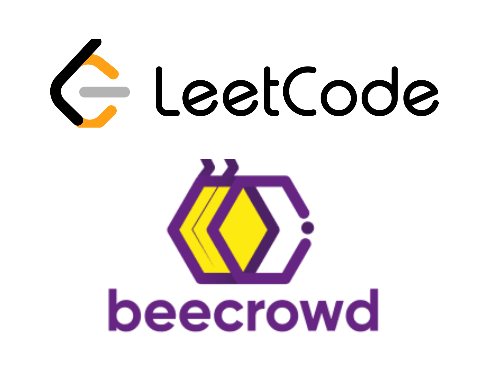

# Training with Beecrowd & LeetCode

## LeetCode Solved Exercises

Welcome to my directory of solved exercises from the LeetCode platform! Here are the exercises I've solved, organized by programming language.

###  

### 

## Beecrowd Solved Exercises

Welcome to my directory of solved exercises from the Beecrowd platform! Here are the exercises I've solved, organized by programming language.

###  

###  

###  

###  

### 

## Contact
Passionate about technology, an eternal learner.

| Anthony Ricardo Rodrigues Rezende | 
| --- |
|  | 

- **Email:** anthony_rodriguespereira@outlook.com
- **LinkedIn:** [Anthony's LinkedIn](https://www.linkedin.com/in/anthony-ricardo-rodrigues-rezende-486917227/)
- **Beecrow:** [Anthony's Beecrowd](https://www.beecrowd.com.br/judge/pt/profile/639361)
- **LeetCode:** [Anthony's LeetCode](https://leetcode.com/Pereira3RR/)

## Resources

Here are some useful resources to continue learning and practicing:

- [Leetcode](https://leetcode.com/)
- [Beecrowd](https://www.beecrowd.com.br/)

---

Feel free to explore the solved exercises in different programming languages.
